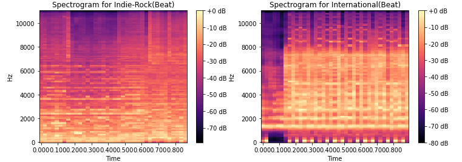

# Audio Analysis & Affective Music Prediction 

## Overview
This project explores the application of Deep Learning techniques for **Music Information Retrieval (MIR)**. It tackles two distinct challenges using the **Free Music Archive (FMA)** dataset:
1.  **Music Genre Classification**: Classifying songs into genres (Rock, Electronic, Jazz, etc.) using LSTM and CNN architectures.
2.  **Affective Attribute Regression**: Predicting continuous emotional attributes of music—**Valence** (positivity), **Energy**, and **Danceability**.

The project progresses from baseline models to advanced strategies like **Transfer Learning** and **Multitask Learning** to overcome data scarcity and improve prediction accuracy.

## Dataset
The project utilizes a subset of the **Free Music Archive (FMA)** dataset, processed into three feature formats:
* **Mel-Spectrograms**: Visual representation of the audio frequency spectrum.
* **Beat-Synced Spectrograms**: Features aligned to the song's tempo to reduce sequence length.
* **Chromagrams**: Features capturing harmonic and melodic content (12 pitch classes).

> **Note on Data Access**:
> The raw data is not included in this repository due to size constraints.
> 1. Download the dataset from [Kaggle](https://www.kaggle.com/datasets/imsparsh/patreco3-multitask-affective-music).
> 2. Extract it into a folder named `data/` in the root directory.
> 3. The code handles pathing automatically via the `DATA_DIR` configuration.

## 🛠️ Methodology

### 1. Data Preprocessing & EDA
* Visualization of Mel-spectrograms and Chromagrams for different genres.
* Class imbalance handling (merging similar genres like 'Post-Rock' into 'Rock').
* **Zero-Padding** and **Packing Sequences** to handle variable-length audio inputs in PyTorch.

<p align="center">
  
</p>

### 2. Architecture Comparison (Genre Classification)
We implemented and compared two deep learning architectures:
* **LSTM (Long Short-Term Memory)**: A recurrent network designed to capture temporal dependencies in audio sequences.
* **CNN (Convolutional Neural Network)**: A 2D CNN treating spectrograms as images.
    * **Result**: The CNN significantly outperformed the LSTM (~43% vs ~36% accuracy on the test set), proving more effective at extracting spatial features from spectrograms.

### 3. Emotion Regression (Valence, Energy, Danceability)
We shifted from classification to regression to predict continuous emotion scores.
* **Evaluation Metric**: Spearman Correlation Coefficient (to measure monotonic relationships).
* **Baseline**: Individual CNNs trained for each attribute.

### 4. Advanced Techniques
To boost performance on the limited regression dataset, we implemented:
* **Transfer Learning**: Fine-tuning the CNN pre-trained on the large Genre Classification task to predict Valence.
    * *Impact*: Valence correlation improved from **~40% to ~49%**.
* **Multitask Learning**: Training a *single* CNN to predict Valence, Energy, and Danceability simultaneously using a weighted loss function.
    * *Impact*: Achieved the best overall performance and training efficiency.

## Project Structure

```text
├── data/                     # Download dataset here
├── images/                   # Visualizations for README
├── lab3.ipynb                # Main Jupyter Notebook containing all experiments
├── README.md                 # Project documentation
└── requirements.txt          # Python dependencies
```

